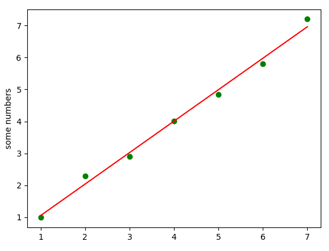

# Least-squares-line-fitting-algorithm
simple algorithm in python to fit the line squares

Fits like this:

Usage: 

This is excellent to be used in time drift applications. 
When you have 2 time sources which are precise and not the same, usually it is good to have some kind of a history in a ring or circular buffer of the last, let's say 10 points, then do the line fitting to convert offsets from one timebase to another.
